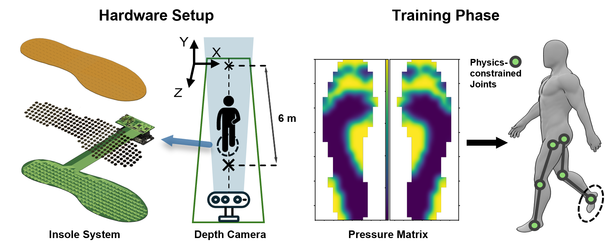
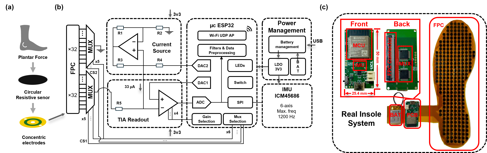

# Pressure2Pose

Real-time 3D human pose estimation from plantar pressure insoles using SMPL body model.

<p align="center">
  
</p>

This repo contains code and design files for the following publications:


**[ISCAS 2025]** [High-Resolution Plantar Pressure Insole System for Enhanced Lower Body Biomechanical Analysis](https://ieeexplore.ieee.org/abstract/document/11044303)
Junjian Chi, Qingyu Zhang, Zibo Zhang, Andreas Demosthenous and Yu Wu, Circuit and System Group, University College London
***CNN-LSTM pressure-to-pose pipeline, MediaPipe joint prediction, custom insole hardware design***

**[ISCAS 2026]** Multimodal Smart Insole with Crossbar Crosstalk Compensation for Fall-Risk Prediction
Junjian Chi, Zibo Zhang, Qingyu Zhang, Andreas Demosthenous and Yu Wu, Circuit and System Group, University College London
***Dual-frame readout with dynamic range increment, IMU fusion, fall-risk assessment***

**[Reconfiguration]** Physics-constrained Pressure to SMPL Prediction
***Mediapipe label cleaner, SMPL parameter regression***


## Overview

This repo provides:

1. **Custom pressure insole hardware** — PCB design files (Altium Designer), laser-cut conductive polymer sensor pattern, ESP32-S3 MCU firmware (ESP-IDF), and host-side Python tools for real-time data collection, pressure visualization, and camera-synchronized recording. The sensor array is 33 rows x 15 columns per foot (495 taxels), read via transimpedance amplifier (TIA) with analog MUX scanning, transmitted over WiFi UDP at 30 Hz.

2. **Physics-constrained label generation** — A two-stage pipeline that converts noisy monocular pose estimates into physically plausible SMPL body model parameters. Stage 1 cleans raw MediaPipe 3D joints by enforcing bone length consistency across frames, bilateral limb symmetry, and temporal Gaussian smoothing. Stage 2 fits SMPL parameters (10 betas + 69 body_pose + 3 global_orient + 3 transl = 85 dims) per frame using differentiable optimization with joint angle limits, pose priors, and anatomical constraints, producing ground-truth PKL files for training.

3. **Multi-architecture training pipeline** — Predicts SMPL body model parameters from pressure sequences using a shared CNN spatial encoder (4-layer, 32->64->128->256 channels, AdaptiveAvgPool -> 512-d feature) and four separate MLP regression heads (betas, body_pose, global_orient, transl). The full 3D body mesh (6890 vertices, 13776 faces) is recovered via differentiable SMPL forward kinematics. Five temporal architectures are compared:

| Model | Temporal Module | ~Params |
|-------|----------------|---------|
| CNN Baseline | None (single frame) | 1.09M |
| CNN + BiGRU | Bidirectional GRU, h=256, 2 layers | 3.71M |
| CNN + BiLSTM | Bidirectional LSTM, h=256, 2 layers | 4.49M |
| CNN + TCN | 4 dilated Conv1d blocks (d=1,2,4,8) | 3.72M |
| CNN + Transformer | TransformerEncoder, d=512, 8 heads, 4 layers | 9.50M |

## Hardware

The insole system consists of a flexible printed circuit (FPC) pressure sensor array with concentric circular electrodes, a custom MCU board based on ESP32-S3 (with analog MUX, TIA readout, DAC excitation, and 6-axis IMU ICM-45686), and a host PC for data collection and model inference.

<p align="center">
  
</p>

Design files are organized under `hardware/`:

```
hardware/
├── insole_fpc_ver1/        # FPC sensor array v1 (Altium SchDoc + PcbDoc)
├── insole_fpc_ver2/        # FPC sensor array v2 + production gerber
├── sensor_laser_cut/       # Laser-cut conductive polymer sensor pattern (.dip)
└── mcu_pcb/                # MCU board (schematic PDF + PcbDoc + gerber)
```

**Firmware** — The ESP32-S3 firmware is built with [ESP-IDF v5.x](https://docs.espressif.com/projects/esp-idf/en/latest/esp32s3/get-started/) and located in `firmware/`. It handles ADC continuous scanning, DAC excitation, MUX control, IMU SPI communication, WiFi UDP streaming, and sensor configuration. To flash:

```bash
cd firmware && idf.py set-target esp32s3 && idf.py build && idf.py flash monitor
```

**Host tools** — Python scripts in `host/` for interacting with the insole hardware over WiFi UDP (default `192.168.137.1:8999`):

```bash
# Record pressure + camera data simultaneously (edit paths in script before use)
python host/data_log/cam_pressure_record.py

# Live pressure heatmap visualization (single foot / dual foot / with IMU)
python host/live_pressure_visualize/single_pressure_server.py
python host/live_pressure_visualize/double_pressure_server.py
python host/live_pressure_visualize/double_pressure_imu_server.py

# Real-time inference with trained model
python host/inference/realtime_inference.py --checkpoint checkpoints/cnn_bigru_best.pth --input data/walking1_cleaned.csv

# Live 3D body visualization
python host/visualizer/live_visualizer.py
```

## Installation

```bash
pip install -r requirements.txt
```

Download the SMPL model (requires registration at https://smpl.is.tue.mpg.de/). Extract it so that the model files are at:

```
smpl_models/SMPL_python_v.1.1.0/SMPL_python_v.1.1.0/smpl/models/
```

Key dependencies: `torch>=2.0`, `smplx`, `open3d`, `numpy`, `pandas`, `scipy`, `opencv-python`, `tqdm`, `pyyaml`, `tensorboard`, `matplotlib`, `trimesh`

For ESP32-S3 firmware, install [ESP-IDF v5.x](https://docs.espressif.com/projects/esp-idf/en/latest/esp32s3/get-started/).

## Usage

### 1. Label Generation

**Step 1 — Clean MediaPipe labels.** Apply physical constraints (bone length consistency, bilateral symmetry, temporal Gaussian smoothing) to raw MediaPipe 3D joint predictions. Optional flags: `--no_symmetry`, `--no_temporal`, `--no_gait_prior`, `--smoothing_sigma 2.0`.

```bash
python preprocessing/clean_mediapipe_labels.py --input_csv data/walking1.csv --output_csv data/walking1_cleaned.csv
```

**Step 2 — Fit SMPL parameters.** Estimate body shape (betas) from median bone lengths across all frames, then fit lower-body pose per frame using differentiable optimization with joint angle limits and pose priors. Outputs a PKL file containing per-frame betas, body_pose, global_orient, and transl.

```bash
python preprocessing/fit_smpl_physics.py --input_csv data/walking1_cleaned.csv --output_pkl data/smpl_params/walking1_physics.pkl --num_iterations 200
```

Use `--max_frames 500` to fit a subset for quick testing. Use `--start_frame 0 --end_frame 300` to fit a specific range. Use `--subsample 2` to skip every other frame.

### 2. Visualize SMPL

Interactive 3D viewer with Open3D. Supports single-frame inspection, sequence playback, and video export.

```bash
# View a single frame with joint spheres
python tools/visualize_smpl_open3d.py --smpl_params data/smpl_params/walking1_physics.pkl --smpl_path smpl_models/SMPL_python_v.1.1.0/SMPL_python_v.1.1.0/smpl/models --frame_idx 10 --show_joints

# Play sequence animation
python tools/visualize_smpl_open3d.py --smpl_params data/smpl_params/walking1_physics.pkl --smpl_path smpl_models/SMPL_python_v.1.1.0/SMPL_python_v.1.1.0/smpl/models --play_sequence --fps 30

# Save as video file
python tools/visualize_smpl_open3d.py --smpl_params data/smpl_params/walking1_physics.pkl --smpl_path smpl_models/SMPL_python_v.1.1.0/SMPL_python_v.1.1.0/smpl/models --save_video output/walking1.mp4 --fps 30

# Visualize a specific frame range
python tools/visualize_smpl_open3d.py --smpl_params data/smpl_params/walking1_physics.pkl --smpl_path smpl_models/SMPL_python_v.1.1.0/SMPL_python_v.1.1.0/smpl/models --play_sequence --start_frame 100 --end_frame 500 --fps 30
```

Generate showcase images (pressure heatmap + 3D mesh side by side, 300 DPI):

```bash
python tools/generate_showcase.py --csv data/walking1_cleaned.csv --pkl data/smpl_params/walking1_physics.pkl --smpl_path smpl_models/SMPL_python_v.1.1.0/SMPL_python_v.1.1.0/smpl/models --output_dir output/showcase
```

### 3. Train

Interactive notebook with all 5 model architectures, training loops, comparison table, and visualization:

```bash
jupyter notebook notebooks/train_compare.ipynb
```

Or command-line training using `configs/default.yaml`:

```bash
python train.py --config configs/default.yaml
```

To change model architecture, edit `model.type` in `configs/default.yaml`:
- `cnn_baseline` — single-frame CNN (no temporal context)
- `cnn_bigru` — CNN + Bidirectional GRU (default)
- `cnn_bilstm` — CNN + Bidirectional LSTM
- `cnn_tcn` — CNN + Temporal Convolutional Network (dilated causal convolutions)
- `cnn_transformer` — CNN + Transformer Encoder (sinusoidal positional encoding)

Training features: TensorBoard logging (`logs/`), periodic checkpointing (`checkpoints/`), early stopping (patience=20 on validation MPJPE), gradient clipping (max norm=1.0 for RNN models), LR warmup (5 epochs for Transformer), StepLR scheduler (step=20, gamma=0.5).

Resume from checkpoint:

```bash
python train.py --config configs/default.yaml --resume checkpoints/cnn_bigru_epoch_40.pth
```

### 4. Evaluate

Run evaluation on the validation or test set. Computes all metrics: MPJPE, PA-MPJPE (Procrustes-aligned), per-vertex mesh error, bone length error, and per-frame inference time. Requires a trained SMPL layer for forward kinematics.

```bash
python evaluate.py --config configs/default.yaml --checkpoint checkpoints/cnn_bigru_best.pth
```

Evaluate on test split and save metrics to JSON:

```bash
python evaluate.py --config configs/default.yaml --checkpoint checkpoints/cnn_bigru_best.pth --split test --output output/metrics.json
```

### 5. Inference

Run a trained model on new pressure data and save predicted SMPL parameters as PKL. Handles both single-frame (CNN Baseline) and temporal models (BiGRU/BiLSTM/TCN/Transformer). For temporal models, the sliding window (T=32) is zero-padded at sequence boundaries.

```bash
python inference.py --config configs/default.yaml --checkpoint checkpoints/cnn_bigru_best.pth --input data/walking1_cleaned.csv --output output/walking1_pred.pkl
```

The output PKL can be visualized directly with `tools/visualize_smpl_open3d.py`.

### 6. Extract Joint Angles

Extract joint angles from SMPL parameters to CSV for biomechanical analysis (e.g., gait cycle analysis, range of motion assessment):

```bash
python tools/extract_joint_angles.py --smpl_params data/smpl_params/walking1_physics.pkl --output output/joint_angles.csv --format euler
```

Supported formats: `euler` (roll/pitch/yaw in radians), `axis_angle` (3D rotation vectors), `degrees` (Euler angles in degrees)

## Methodology

See [docs/methodology.md](docs/methodology.md) for detailed documentation on:
- Loss function design (joint MSE, vertex MSE, shape/pose regularization, weighting strategy)
- Evaluation metrics (MPJPE, PA-MPJPE, vertex error, bone length error)
- Model architecture details (shared CNN encoder, 4 MLP heads, 5 temporal variants)
- Training configuration and hyperparameters
- Label generation pipeline (MediaPipe cleaning + physics-aware SMPL fitting)

## Acknowledgments

- [SMPL](https://smpl.is.tue.mpg.de/) body model: Max Planck Institute for Intelligent Systems
- [MediaPipe](https://mediapipe.dev/) 3D pose estimation: Google
- [ESP-IDF](https://docs.espressif.com/projects/esp-idf/) firmware framework: Espressif Systems
- [smplx](https://github.com/vchoutas/smplx) PyTorch layer: Vassilis Choutas
- [Open3D](http://www.open3d.org/) 3D visualization: Intel ISL
