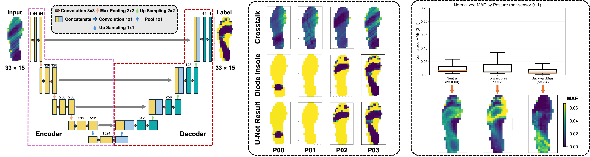
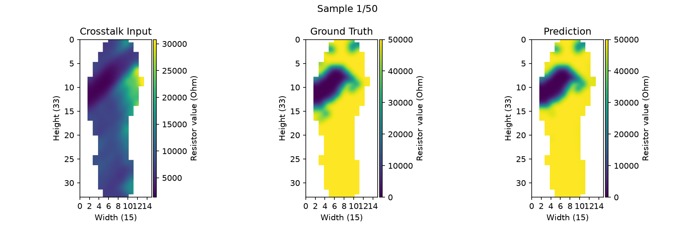

# Pressure2Pose

Two algorithms for our 253-sensor resistive plantar-pressure insole, released in
[JunjianChi/smartinsole](https://github.com/JunjianChi/smartinsole). One predicts lower-body marker
positions from a pair of pressure maps and a pair of shank IMUs. The other reconstructs those maps
from the crossbar readout, where sneak-path currents at this sensor density distort every reading.

## Pose estimation

The distribution of plantar force across the phases of the gait cycle carries the detailed motion of
the lower-body joints. Optical motion capture reads that motion directly but is limited by occlusion
and cost, and insole systems have mostly used a small number of large sensors, which underestimate
peak pressure and lose the detail a foot region carries.

<p align="center">
  <br>
  <em>A held-out participant. The two pressure maps and the shank signal are the whole input;
  shading marks the intervals where that foot is off the ground.</em>
</p>

Pressure vanishes when the foot leaves the ground, which is when the leg moves most. A shank IMU
covers exactly that gap, so the two inputs fail in disjoint intervals. A causal temporal
convolutional network takes both and predicts ten lower-body marker positions per frame,
root-relative to the pelvis with yaw removed.

<p align="center">
  <br>
  <em>Two branches into one causal model: the computed shank IMU above, MovePort pressure mapped
  onto our array below, and a head that emits a mean and a log variance per marker.</em>
</p>

The model is trained and tested on MovePort, a released dataset with co-recorded plantar pressure
and optical motion capture. Its IMUs are located on the feet, while ours are placed on the shank, so
we simulate a shank IMU from the motion capture, driving it through OpenSim inverse kinematics at a
declared 0.35 s availability bound.

The fused model holds 591.7k parameters over a 1.02 s receptive field. Holding out participants
across four folds it reaches 59.48 mm, against 134.92 mm for the mean pose and 26.32 mm better than
pressure alone, with all 23 participants improving. Training details are specified in
[pose-estimation/README.md](pose-estimation/README.md).

## Crosstalk correction

Sneak-path currents in a resistive crossbar pressure array distort every sensor reading. A U-Net
takes the distorted 33x15 frame and reconstructs the crosstalk-free frame that a diode-isolated
reference array measures under the same load. The method is from our ISCAS 2026 paper
([doi:10.1109/ISCAS66217.2026.11562098](https://doi.org/10.1109/ISCAS66217.2026.11562098)).

<p align="center">
  <br>
  <em>From our ISCAS 2026 paper: the full-size U-Net, sample corrections, and per-posture error.</em>
</p>

The paper reports no parameter count; its implementation holds 31.0M. This repository implements
`UNet`, a 467k-parameter variant with the active-sensor mask as a second input channel, small
enough (1.8 MB in float32) to run in real time on modest hardware. On 12,150 frame pairs from the
stacked crossbar/diode setup it reaches R² = 0.926 on the test set, a random frame split that makes
the score optimistic, where a parameter-matched MLP reaches 0.833. One frame takes 0.9-1.3 ms on an
Apple M4 CPU, against 6.3 ms for the full-size model on the same machine. The capture is not
released. Setup, training, and evaluation are in [crosstalk-unet/README.md](crosstalk-unet/README.md).

<p align="center">
  <br>
  <em>Fifty test frames in ohms: the crossbar input on its own scale, the diode reference, and
  the U-Net output.</em>
</p>


## Acknowledgements

The pose model is trained and evaluated on MovePort:

> Fu et al., *MovePort: Multimodal Dataset of EMG, IMU, MoCap and Insole Pressure for Analyzing
> Abnormal Movements and Postures in Rehabilitation Training*.
> [10.6084/m9.figshare.25202183](https://doi.org/10.6084/m9.figshare.25202183), CC BY 4.0.

The OpenSim project and the Gait2392 model bundle provide the musculoskeletal route the computed
shank channel goes through.

## Citation

The crosstalk U-Net and the insole it runs on are introduced in our ISCAS 2026 paper:

```bibtex
@inproceedings{chi2026insole,
  author    = {Chi, Junjian and Zhang, Zihuan and Zhang, Qingyu and Demosthenous, Andreas and Wu, Yu},
  title     = {Multimodal Smart Insole with Crossbar Crosstalk Compensation for Fall-Risk Prediction},
  booktitle = {2026 IEEE International Symposium on Circuits and Systems (ISCAS)},
  year      = {2026},
  doi       = {10.1109/ISCAS66217.2026.11562098},
}
```
