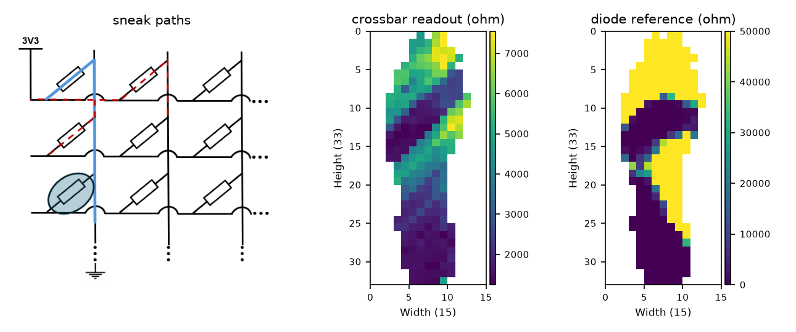
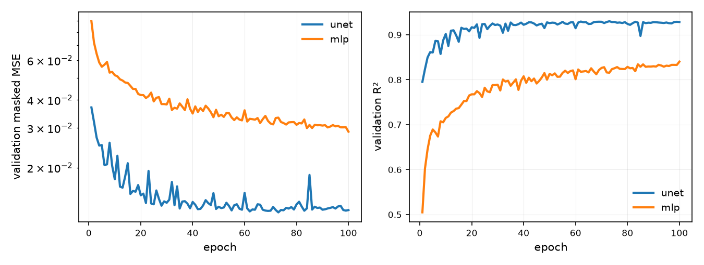
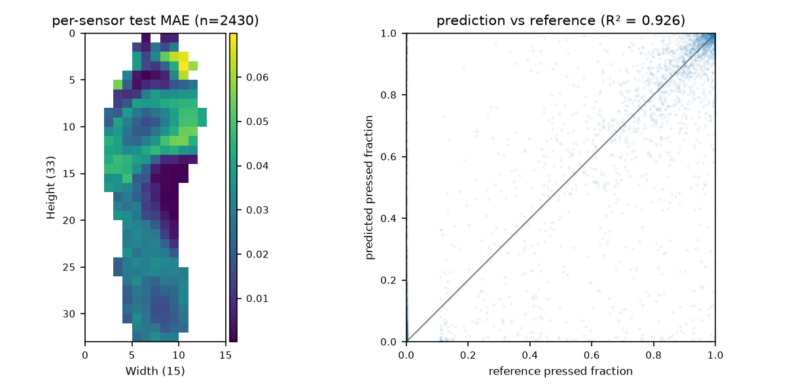

# crosstalk-unet

A small U-Net that removes sneak-path crosstalk from the 253-cell crossbar insole: it takes a
distorted 33x15 resistance frame and reconstructs the frame a diode-isolated reference array
measures under the same load. The method is from our ISCAS 2026 paper (see
[Citation](#citation)). The paper reports the method but no parameter count; its implementation
holds 31.0M. This project trains a 467k-parameter variant for real-time use, with the
active-sensor mask as a second input channel.

## The problem

Reading one crossbar cell drives its row and grounds its column, and current through every
neighbouring cell distorts the measurement:

<p align="center">
  <br>
  <em>Reading one cell (blue) also drives its neighbours (red dashed). A captured frame (middle)
  buries the true load pattern (right) under diagonal streaks along the wiring order.</em>
</p>

`crosstalk/simulate.py` reproduces the mechanism by nodal analysis of the resistor grid and can
generate paired frames from any ground-truth resistance map (`scripts/plot_simulation.py` renders
an example).

## Setup

```bash
python -m venv .venv && source .venv/bin/activate
python -m pip install -e ".[dev]"
```

## Data

12,150 frame pairs recorded with the stacked crossbar/diode setup: the crossbar readout and the
diode-isolated reference measured under the same load, both on the 33x15 array in ohms. 9,720 pairs
train and 2,430 test. Four of the 253 positions return a reading but are electrically faulty, so the
loss and every score below cover the remaining 249 active cells.

The capture is not released. Its train/test split is a seeded frame-level `random_split`, so neither
the test set nor the validation tail is temporally independent of the training frames and both
scores are optimistic.

`crosstalk/synthetic.py` generates pairs in the same format, so training and evaluation run without
the capture. Those pairs carry the sneak-path mechanism but not the insole's Howland front end, so a
model trained on them demonstrates the pipeline and does not reproduce the numbers below.

```bash
python scripts/make_synthetic.py                                    # simulated pairs, no hardware
python scripts/import_lab_data.py --source /path/to/paired_archives # the paired capture archives
python scripts/prepare_data.py --csv capture.csv                    # a live two-client capture
```

## Training

Adam, learning rate 1e-3, batch size 32, 100 epochs, seed 0. The loss is MSE over active cells.
The last 20% of the training archive is the validation set and the checkpoint with the best
validation R² is kept. Training is deterministic on CPU.

```bash
python scripts/train.py --data data/processed/lab_train.npz --out checkpoints/unet_lab.pt
python scripts/train.py --data data/processed/lab_train.npz --model mlp --out checkpoints/mlp_lab.pt
```

<p align="center">
  
</p>

## Results

```bash
python scripts/infer.py --data data/processed/lab_test.npz --weights checkpoints/unet_lab.pt
```

| model | params | test MSE | test R² | inference (CPU) |
|---|---:|---:|---:|---:|
| `FrameMLP` baseline | 446k | 0.0300 | 0.833 | 0.02 ms |
| `UNet` (depth 2) | 467k | 0.0134 | **0.926** | 0.9-1.3 ms |
| paper U-Net (full size) | 31.0M† | 0.0142* | 0.9307* | 6.3 ms |

† counted from the paper's implementation, which the paper itself does not quote.

\* MSE and R² as published (Table I) on the paper's own split, not directly comparable to the
rows above. The three latencies are all measured here on one Apple M4 CPU (torch 2.13.0, batch 1,
33x15 input, `--threads 4`), the paper U-Net from its original implementation. Five repeats of
`scripts/benchmark.py` spread over 0.87-1.27 ms mean for the U-Net, so the column is a range and
the 6.3 ms row carries the same uncertainty.

`FrameMLP` is parameter-matched to the U-Net, so the score gap measures locality and weight
sharing against a dense bottleneck. At 66x fewer parameters, `UNet` lands within the
paper's published per-posture range (R² 0.887–0.943). Both models are trained once at seed 0, so
the 0.09 gap between them carries no estimate of seed variation. Padding 33x15 up to 36x16 puts
16% more cells through each forward pass than cropping at every level would.

<p align="center">
  <br>
  <em>Per-sensor test MAE: 0.028 at the median, 0.070 at the worst cell. The largest errors sit in
  one patch near the toe end of the array; the rest is flat to within a factor of two.</em>
</p>

## More

```bash
python scripts/benchmark.py       # per-frame latency and FPS for both models
python -m pytest -q               # 26 tests, no data needed
```

The tests cover the simulator against known-answer cases (an isolated cell reads its true value,
open neighbours recover it, sneak paths only ever lower a reading), the masked metrics against
streaming and whole-array evaluation, and the frame pairing at its time and empty-frame bounds.

`plot_real_readout.py --schematic ../assets/crosstalk_circuit.png` rebuilds the problem figure.
The other `plot_*.py` scripts regenerate the rest.

## Citation

```bibtex
@inproceedings{chi2026insole,
  author    = {Chi, Junjian and Zhang, Zihuan and Zhang, Qingyu and Demosthenous, Andreas and Wu, Yu},
  title     = {Multimodal Smart Insole with Crossbar Crosstalk Compensation for Fall-Risk Prediction},
  booktitle = {2026 IEEE International Symposium on Circuits and Systems (ISCAS)},
  year      = {2026},
  doi       = {10.1109/ISCAS66217.2026.11562098},
}
```
