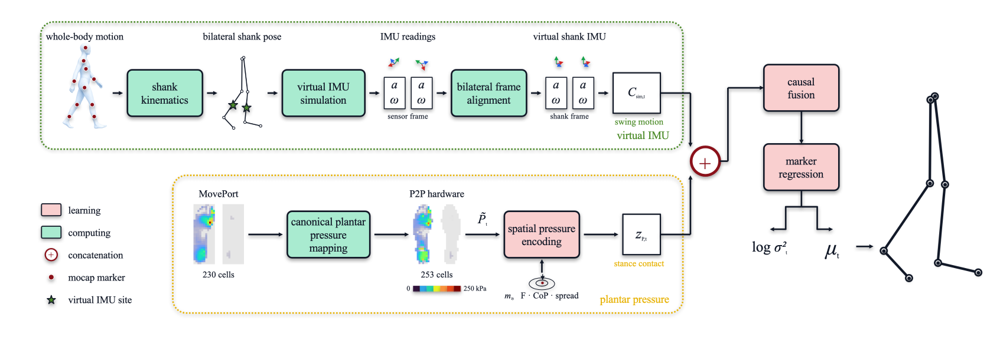
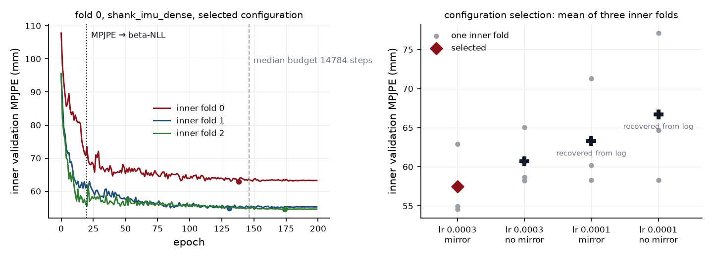
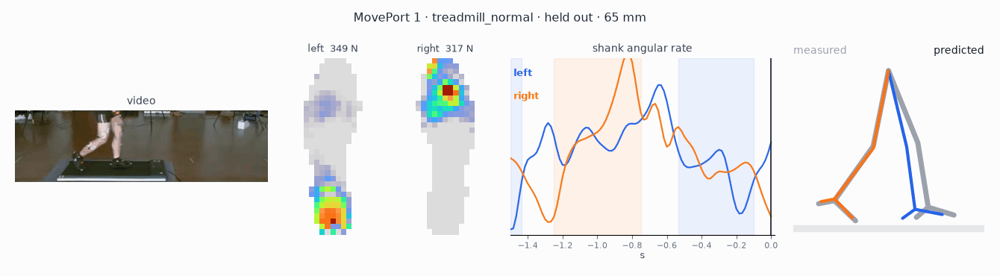

# pose-estimation

A causal temporal convolutional network that predicts ten lower-body marker positions at 60 Hz from
a pair of 33x15 plantar-pressure maps and a pair of six-axis shank IMUs. Over 23 held-out
participants it reaches 59.48 mm mean per-marker position error, against 85.80 mm for the same
network given pressure alone.

Plantar force over the gait cycle carries the motion of the lower-body joints, but pressure vanishes
the moment the foot leaves the ground, which is when the leg moves most. A shank IMU covers that
gap, and is blind where pressure is informative: in a lean the shank barely rotates while the centre
of pressure travels the length of the foot.

## Approach

<p align="center">
  <br>
</p>

Training needs pressure and pose recorded together.
[MovePort](https://doi.org/10.6084/m9.figshare.25202183) provides both over seven activities: 23 of
its 24 released participants enter the study, giving 355 segments and 924,360 frames on a 60 Hz
clock. Its insoles are 31x11 and ours are 253 cells, so every frame is resampled between the two
arrays. The resampling conserves force, since the two cell areas differ and a sum of pressure values
would bias whichever insole is smaller. The regression target is ten anatomical markers in metres,
root-relative to the pelvis with yaw removed, valid on 920,100 of the frames.

MovePort ships no synchronisation proof for its streams, so the alignment here is a declared
convention. Pressure, motion capture and the released foot IMUs are each zeroed at their own first
sample and resampled onto one 60 Hz clock through the same causal low-pass, whose 24 Hz
half-amplitude response gives every stream a stated 0.10 s group delay. The 60 Hz and 100 Hz source
recordings pass through that same response, so a residual between them cannot manufacture an impact
artefact.

Each frame is then divided by its own two-foot total load, so the encoder sees how load is
distributed between and within the feet while body mass is removed. The absolute force enters
separately through a log1p channel. This normalisation is what allows one model to serve
participants of different mass.

MovePort's IMUs are located on the feet, while ours are placed on the shank, so we simulate a shank
IMU from its motion capture. Marker trajectories pass through OpenSim inverse kinematics, then a
fixed-lag smoother which filters a trailing buffer and evaluates a spline at a lagged time, so that
every output depends only on past samples. A six-axis IMU is then sampled from that trajectory
0.065 m proximal of each ankle joint centre, then paired back onto the 60 Hz clock by physical time
at a declared 0.35 s availability delay. Simulating inertial measurements from body motion is the
approach introduced by DIP and TransPose, and every number below rests on that simulated input.

The pressure encoder applies three 2-D convolutions over the 33x15 footprint with two coordinate
channels appended, so that a shared kernel can still respond to position. It carries no global
pooling stage, because pooling to a single vector would map a heel-loaded and a forefoot-loaded
footprint onto the same representation. Six per-foot summary features, which are total force, centre
of pressure, its spread, and contact area, are concatenated into the final linear layer, since these
are exactly computable and a convolution has no reason to rediscover them. The temporal stack is
left-padded only, so output *t* reads no input after *t*, and dilations 1, 2, 4, 8 in blocks of two
give a receptive field of 61 frames, or 1.02 s, one gait cycle. The fused model holds 591.7k
parameters and its float32 checkpoint occupies 2.4 MB.

## Training

The model is meant to generalise to participants it has never seen, so all 23 train together and
every reported score comes from held-out people. Plantar pressure is strongly person-specific, since
arch shape and gait identify the wearer, which means a split over frames, windows, or segments would
leak a participant into their own test score. Splits are therefore made by subject.

Four folds hold every participant out exactly once. A single held-out group would leave the reported
figure to the draw: per-participant scores run from 42.43 to 79.49 mm, and over all 100,947 ways to
pick six of the 23 the mean lands anywhere within a 23 mm band.

Inside each fold the chain below runs in order, and nothing later in it sees the held-out
participants:

1. **Select** the learning rate over {1e-4, 3e-4} and reflection augmentation, on three
   subject-disjoint inner folds, scored by validation error averaged per participant.
2. **Retrain** the winner on the whole development set for the median inner-selected step budget,
   with no validation-based stopping, so that the budget itself never touches held-out data.
3. **Score** once over the held-out participants, running whole segments from their true start.

The head predicts a log-variance alongside each marker mean, which makes the training objective a
Gaussian likelihood. A plain Gaussian NLL weights each marker's mean-gradient by its inverse
variance, so a marker that fits early shrinks its own variance, claims a growing share of the
gradient, and leaves the harder markers unattended. beta-NLL (Seitzer et al., ICLR 2022) breaks that
feedback by detaching the variance from the weight and raising it to a power beta, set to 0.5 here.
The first 20 epochs optimise plain MPJPE, because a likelihood started cold grows its variance and
leaves the mean unfitted. Optimisation uses 64-frame windows at stride 32, batch size 256, Adam, and
a cosine schedule over the step budget.

<p align="center">
  <br>
  <em>Fold 0's winning configuration. The loss switch at epoch 20 shows in all three inner folds,
  and inner fold 0 sits 8 mm above the other two, which is the participant spread the four folds
  exist for.</em>
</p>

Each variant is trained with three seeds and the reference configuration with five, giving 92
retrained models over 28 variant-folds.

Deployment cost was measured on an Apple M4 laptop CPU restricted to four threads. Run as a stream,
one frame at a time as the insoles deliver them, the fused model costs 14.05 ms per frame, or 71
frames per second against the 60 Hz the hardware produces. Evaluated offline in batches the same
model amortises to 0.213 ms per frame.

## Results

Every score below follows the protocol above: whole held-out segments, each valid frame counted
once, errors averaged within a participant before being averaged across the 23.

The first experiment removes one input at a time, so that the contribution of each can be read
against the two references at the top of the table.

| model | input | held-out MPJPE |
|---|---|---:|
| mean pose | — | 134.92 mm |
| nearest-pressure retrieval | 253-cell map | 122.72 mm |
| `ponly_moments` | six summaries per foot | 85.44 mm |
| `ponly_dense` | 253-cell map | 85.80 mm |
| `shank_imu_only` | shank IMU alone | 71.70 mm |
| `shank_imu_moments` | summaries + shank IMU | 61.56 mm |
| `shank_imu_dense` | map + shank IMU | **59.48 mm** |

Paired per participant, the fused model beats the pressure-only model by **−26.32 mm**, with a 95%
CI of [−29.64, −22.93] over 15,000 bootstrap resamples and a Wilcoxon p of 2.38e-07, and all 23
participants improve. Comparing the dense map against the six summaries under fusion is
**inconclusive** at −2.08 mm with p = 0.151, so on this cohort the spatial detail of the map buys no
measurable accuracy over force, centre of pressure, spread, and contact area.

<p align="center">
  <br>
  <em>A held-out participant. Everything left of the last panel is the model's entire input.</em>
</p>

The second experiment scores those same models within gait phase and within activity, which shows
where each input carries the estimate and where it stops doing so.

| | pressure | shank IMU | fused |
|---|---:|---:|---:|
| stance, foot loaded | 81.48 mm | 71.84 mm | **59.04 mm** |
| swing, foot in the air | 109.05 mm | 69.03 mm | **61.55 mm** |
| forward lean | 74.29 mm | 91.17 mm | **56.66 mm** |
| half squat | 163.00 mm | 105.67 mm | **98.75 mm** |

The two inputs lead in opposite intervals. Pressure loses 28 mm between stance and swing while the
shank IMU holds within 3 mm, and the order reverses in a lean, where the shank rotates little and
the centre of pressure travels. Half squat is where the fused model is weakest, at 98.75 mm: both
feet stay loaded and nearly still while the shank sweeps a small angular range, so neither input
carries much.

Alignment moves MPJPE by up to 5.9x on identical predictions in published work, so none of these
figures is comparable to an external one without matching the pose target, alignment, and split.
`shank_imu_only` guards against the computed channel simply carrying the labels: its acceptance
range was fixed before any fused result existed, and its four folds land inside it at 73.57, 66.27,
81.86 and 63.79 mm. Two gaps stay open. The two models in the main comparison did not train under
the same loss schedule, because warm-up is counted in epochs while the budget is selected in steps,
and the pooled-resolution curve is specified but unrun.

## Setup

```bash
python -m venv .venv && source .venv/bin/activate
python -m pip install -e ".[dev]"
python -m pytest -q
```

## Reproducing

Start from the MovePort release. The first stage reads its native streams, resamples each onto a
common 60 Hz clock, registers both insoles onto the 253-cell array, and writes every frame once:

```bash
python scripts/build_moveport_native.py --root data/raw/moveport
```

The shank channel is built next, and is the only stage that needs OpenSim. It scales the Gait2392
model to each participant, solves inverse kinematics against the markers, and samples the virtual
IMU along the resulting trajectory:

```bash
python scripts/generate_shank_imu_cache.py --cache data/processed/moveport_all.npz \
    --out results/shank_imu
```

To reproduce one fold of the fused model, run the three-step chain on a single GPU:

```bash
# 1. selection: three inner folds over two learning rates and two augmentation settings
python scripts/train_moveport.py --encoder dense --head free --shank-imu-dir results/shank_imu \
    --fold 0 --seed 0 --inner-fold 0 --lr 3e-4 --out runs/f0/shank_imu_dense/inner
# 2. read those runs back and return the winner with its median step budget
python scripts/select_inner.py --runs runs/f0/shank_imu_dense/inner > selection.json
# 3. score one retrained checkpoint on the held-out participants
python scripts/evaluate_streaming.py --run-json <retrain>.json --checkpoint <retrain>.pt \
    --fold 0 --split test --shank-imu-dir results/shank_imu --out reports/test_s0.json
```

- The effective batch is 256 windows of 64 frames at stride 32, so one optimiser step covers 16,384
  frames.
- Training time is ~4h10m per variant-fold on one RTX 4090, of which ~3h20m is the inner sweep. The
  full matrix of four folds, seven variants and three seeds is 83 GPU-hours, just under three days.
- Every stage except the shank channel runs on CPU.
- We have run five seeds on the reference configuration. The held-out scores are 59.95, 58.94,
  59.56, 60.54 and 58.97 mm (mean 59.59, std 0.68), so a difference below about 1.5 mm should be
  read as seed noise.

Collecting the finished matrix produces the single file every number in this README is read from:

```bash
python scripts/formal_report.py --matrix runs --cache data/processed/moveport_all.npz \
    --out formal_report.json
```

It rejects a matrix whose variants scored different participants, and one which holds a diverged
retrain.

Checkpoints are not published. The inertial input they were trained on is simulated, and the model
has not yet been deployed and tuned on our own hardware, so the weights describe a study, and a
deployable model would need retuning against real hardware.

## Acknowledgements

The model is trained and evaluated on MovePort:

> Fu et al., *MovePort: Multimodal Dataset of EMG, IMU, MoCap and Insole Pressure for Analyzing
> Abnormal Movements and Postures in Rehabilitation Training*.
> [10.6084/m9.figshare.25202183](https://doi.org/10.6084/m9.figshare.25202183), CC BY 4.0.

The OpenSim project and the Gait2392 model bundle provide the musculoskeletal route the computed
shank channel goes through.

The insole this work targets, and the crosstalk compensation that produces its pressure maps, are
described in our ISCAS 2026 paper:

```bibtex
@inproceedings{chi2026insole,
  author    = {Chi, Junjian and Zhang, Zihuan and Zhang, Qingyu and Demosthenous, Andreas and Wu, Yu},
  title     = {Multimodal Smart Insole with Crossbar Crosstalk Compensation for Fall-Risk Prediction},
  booktitle = {2026 IEEE International Symposium on Circuits and Systems (ISCAS)},
  year      = {2026},
  doi       = {10.1109/ISCAS66217.2026.11562098},
}
```
